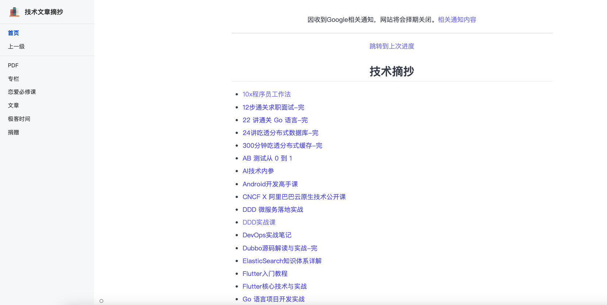
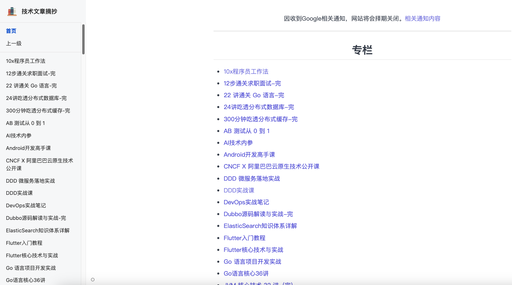
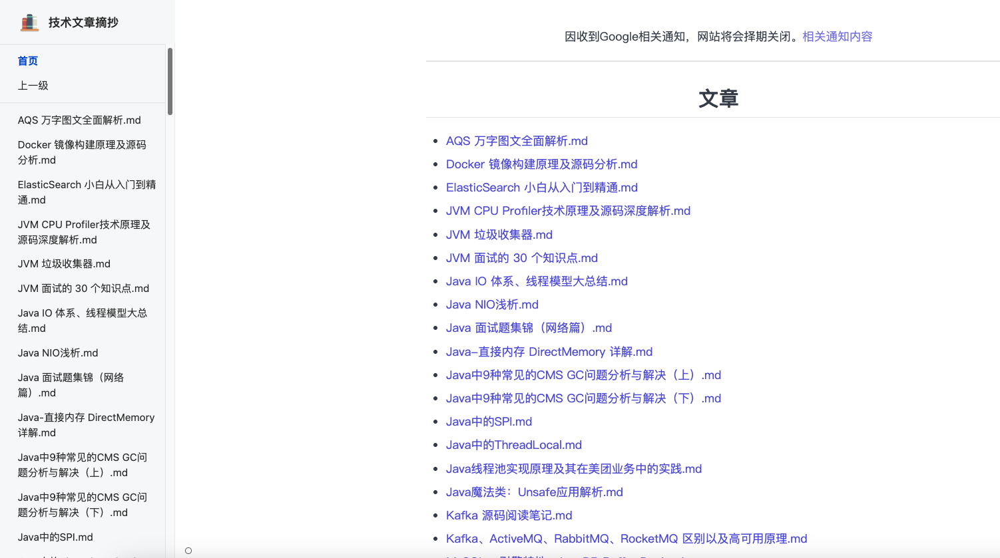
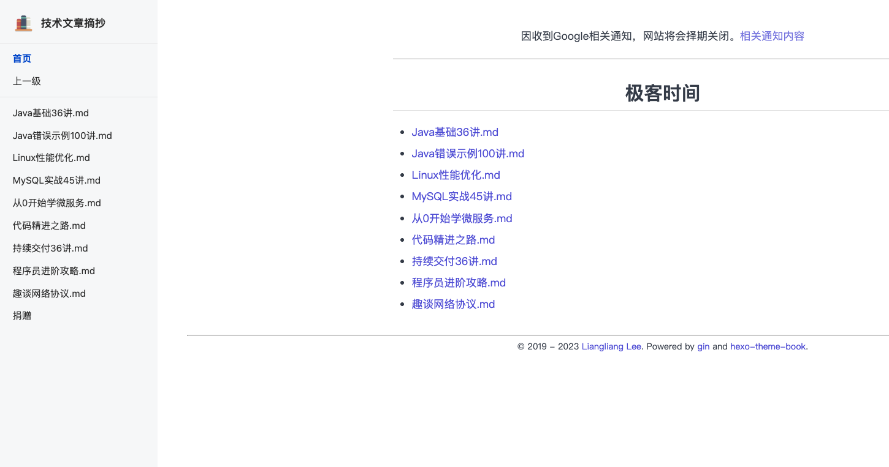
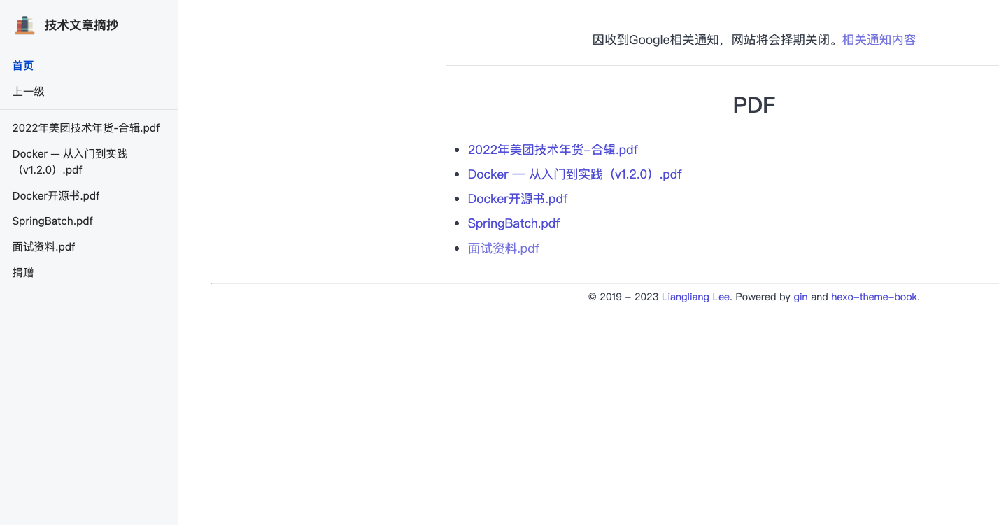
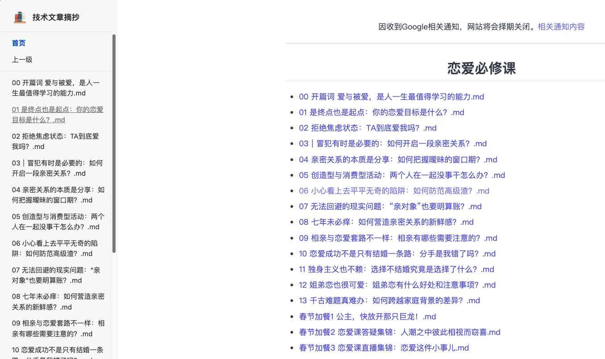

# learn-liangliangleang 技术内容归档 📚

原始网站： [learn.lianglianglee.com](https://learn.lianglianglee.com)

推荐访问： [learn-liangliang.wenxuanhe.top](https://learn-liangliang.wenxuanhe.top) (我们对网站进行了性能优化，并且增加了一些趣味功能)

---

## 1. 项目说明

本项目对原始网站内容进行了系统性备份和整理。learn.lianglianglee.com 是一个极具价值的中文技术学习网站，聚合了大量高质量的技术专栏和精选文章，涵盖后端开发、分布式系统、DevOps、架构设计、面试指南等多个领域。由于服务器到期、费用等问题，原站点有随时关闭的风险，宝贵的技术资料可能会丢失。备用站点将长期维护，确保资料持久保存，不会因原站点关闭而丢失。

## 2. 网站内容介绍 📝

**首页 🏠：聚合导航，快速访问各类技术内容。**

  

**专栏 📖：收录数十个高质量技术专栏，涵盖后端、分布式、架构、前端、AI 等方向。**

  

**文章 📰：精选技术文章，内容包括数据库、微服务、缓存、面试、架构等实战与理论。**

  

**极客时间 ⏰：极客时间等平台的部分优质专栏归档，便于系统性学习。**

  

**PDF 📄：部分资料以 PDF 形式归档，方便离线阅读。**

  

**恋爱必修课 💌：非技术类专栏归档。**

  

## 3. 项目目录说明 🗃️

- **专栏/**：技术专栏归档
- **文章/**：精选技术文章归档
- **极客时间/**：极客时间专栏归档
- **PDF/**：PDF 资料归档
- **恋爱必修课/**：非技术类专栏
- **static/**、**assets/**：静态资源与前端样式
- **img/**：页面截图与图片资源
- **index.html**：网站首页
- 其他辅助脚本和配置文件

## 4. 免责声明 ⚠️

本项目仅用于技术学习与资料备份，所有内容版权归原作者所有，未经许可，请勿用于商业用途。

## 5. 相关信息

## 6. 许可证 📝

本项目采用 MIT License 开源，详见 [LICENSE](./LICENSE) 文件。
